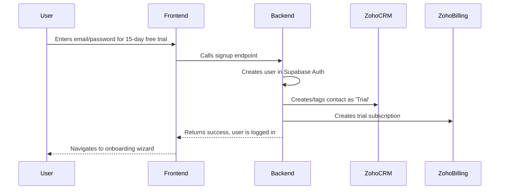
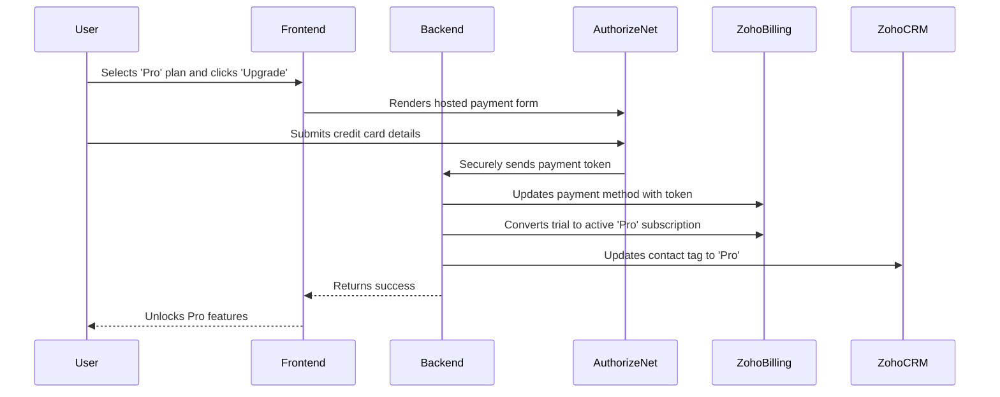

# Architecture

**Version:** 1.1

This document outlines the architecture of the Gig/Freelance Income Reset application, aligning the technical strategy with the business goals of rapid, scalable, and cost-effective market entry.

## 1. Architectural Principles & Business Alignment

- **Speed to Market:** The architecture leverages a pre-integrated, serverless stack (Vercel, Supabase, Zoho) to enable a 12-week MVP launch and capture the first-mover advantage in the gig-economy niche.
- **Low Operating Costs:** The choice of serverless components and a lean 3-developer team, augmented by AI, keeps initial infrastructure costs to an estimated ~$5,000 in Year 1, supporting an aggressive, organic-first GTM strategy.
- **Scalability & Reliability:** The architecture is designed to scale from an initial 500 beta users to 100K+ active users in Year 2 without significant re-engineering, supporting the projected rapid growth.
- **Security & Compliance by Design:** The architecture incorporates security and compliance from the ground up, a key differentiator and trust-builder in a market where users are sensitive about their financial data.

## 2. System Context Diagram

This diagram shows the overall system landscape and how the application interacts with external systems and users.

```mermaid
graph TD
    subgraph "Gig/Freelance Income Reset Platform"
        A[Frontend (Vercel)] --> B{Backend (Supabase)};
    end

    subgraph "Users"
        C[Freelancer/Gig Worker] --> A;
    end

    subgraph "External Services & Integrations"
        B --> D[Zoho CRM (Contacts)];
        B --> E[Zoho Billing (Subscriptions)];
        B --> F[Zoho Books (Accounting)];
        B --> G[Zoho Desk (Support Tickets)];
        B --> H[Authorize.net (Payments)];
        B --> I[Gig Platforms (Fiverr, Upwork, etc.)];
        B --> J[AI - Gemini Vision (OCR)];
        B --> K[AI - LLM (Support & Insights)];
        B --> L[Email (Resend/Zoho Mail)];
    end
```

## 3. Component Diagram

This diagram breaks down the system into its core components and their relationships.

```mermaid
graph TD
    subgraph "Frontend (Vercel)"
        A[React App - Refine/Tailwind] --> B(Supabase Auth);
        A --> C{Backend API - Supabase Edge Functions};
    end

    subgraph "Backend (Supabase)"
        C --> D[PostgreSQL Database (RLS Enforced)];
        C --> E[Supabase Storage (Receipts)];
        F[Supabase Cron (Scheduled Jobs)] --> C;
    end

    subgraph "Integrations Layer"
        C --> G[Zoho Services API Client];
        C --> H[Authorize.net API Client];
        C --> I[Gig Platform API Clients];
        C --> J[AI Services API Client];
    end
```

## 4. Data Flow Diagrams

These diagrams illustrate the sequence of operations for key user flows, designed to be 100% automated.

### a) New User Signup & Freemium Trial Activation



### b) Upgrading to a Paid Plan



## 5. Key Design Decisions & Trade-offs

- **Zoho as the Business Backend:** This is a critical strategic decision. It offloads the immense complexity of billing, subscription management, and accounting, reducing our development scope by an estimated 60%. The trade-off is a dependency on the Zoho ecosystem, which is mitigated by abstracting all interactions behind our own API, preventing vendor lock-in at the UI level.
- **Product-Led Growth Architecture:** The entire architecture is optimized for a self-service, freemium model. This minimizes the need for a sales team and reduces CAC to an industry-leading $10, a key driver of the projected 17x LTV:CAC ratio.
- **AI-Augmented Development:** The use of Google Antigravity is a core part of the operational plan, enabling a lean 3-person team to achieve the productivity of a much larger one. This is a competitive advantage that allows for faster iteration and lower burn rate.
