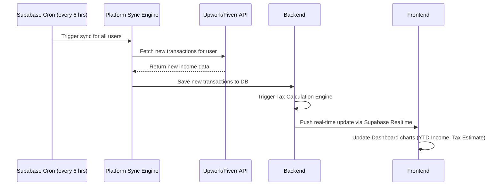
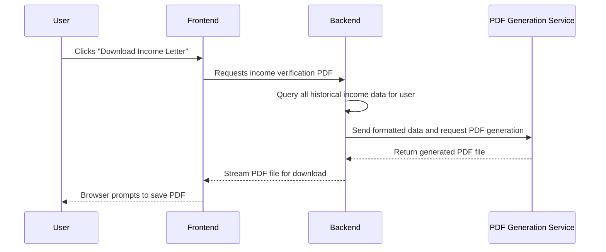
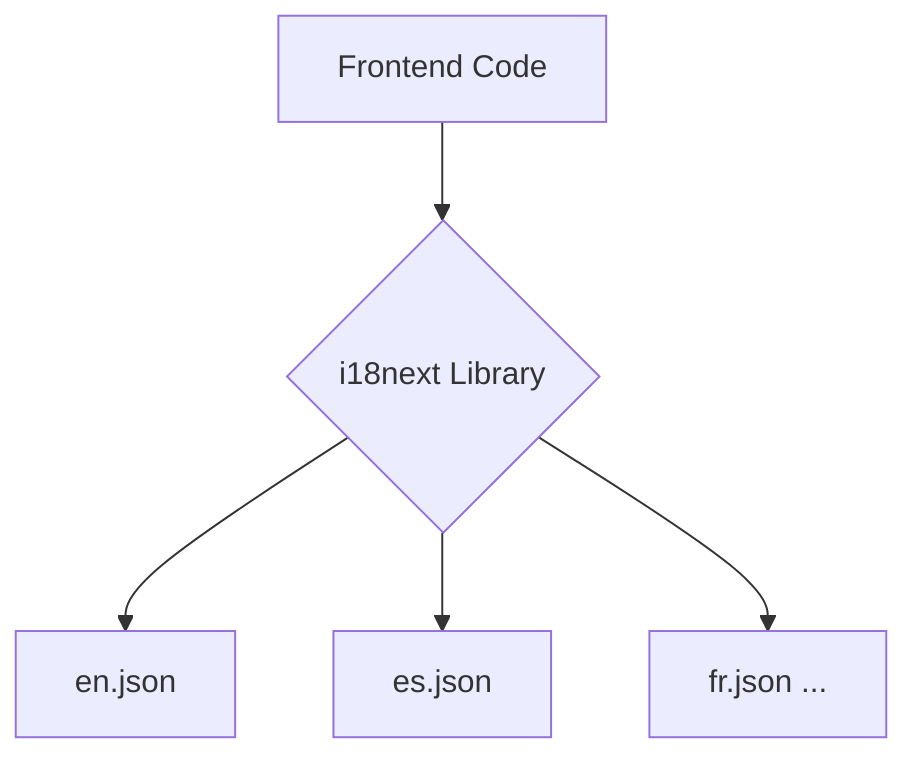

# Architecture

**Version: 4.0**

This document outlines the architecture for the Freelancer Financial Hub. The design is optimized to solve the five core pain points of freelancers by leveraging a modern, scalable, and AI-augmented tech stack.

## 1. Architectural Principles

- **Pain-Point Driven:** Every component of the architecture maps directly to solving a specific, high-severity freelancer pain point (income visibility, tax uncertainty, etc.).
- **Data-First:** The core of the product is a unified financial data model. The architecture prioritizes the accurate and secure aggregation, storage, and analysis of user income and expense data.
- **AI-Augmented:** The architecture is designed to integrate AI services (for OCR, forecasting, and development acceleration) as a core competency, not an afterthought.
- **Lean & Scalable:** The serverless stack (Vercel, Supabase) is chosen to minimize operational overhead and scale seamlessly from the first user to hundreds of thousands, aligning with the product-led growth model.

## 2. System Context Diagram

This diagram shows the high-level system landscape, focusing on the key data flows that solve the core user problems.

```mermaid
graph TD
    subgraph "Freelancer Financial Hub"
        A[Frontend (Vercel/React)] --> B{Backend (Supabase)};
    end

    subgraph "User & External Platforms"
        C[Freelancer] --> A;
        D[Gig Platforms (Upwork, Fiverr, etc.)] <-.-> B;
    end

    subgraph "Backend Services & Integrations"
        B --> E[Zoho CRM/Billing (Subscriptions)];
        B --> F[Zoho Books (Accounting Sync)];
        B --> G[AI - Gemini Vision (Receipt OCR)];
        B --> H[AI - LLM (Forecasting & Support)];
        B --> I[Email Service (Resend/Zoho Mail)];
        B --> J[PDF Generation Service];
    end
```

## 3. Component Diagram

This diagram details the internal components, highlighting the data aggregation and analysis engines.

```mermaid
graph TD
    subgraph "Frontend (Vercel)"
        A[React App - Refine/Recharts] --> B(Supabase Auth);
        A --> C{Backend API - Supabase Edge Functions};
    end

    subgraph "Backend (Supabase)"
        C --> D[PostgreSQL Database (RLS Enforced)];
        D -- contains --> T[Transactions];
        D -- contains --> E[Expenses];
        F[Supabase Cron (Sync Jobs)] --> G[Platform Sync Engine];
        G --> C;
        H[Tax Calculation Engine] --> C;
    end

    subgraph "Integrations Layer"
        G --> I[Gig Platform API Clients];
        C --> J[Zoho API Client];
        C --> K[AI Services API Client];
        C --> L[PDF & Email Clients];
    end
```

## 4. Data Flow Diagrams

### a) Real-Time Income Aggregation & Tax Calculation



### b) On-Demand Income Verification Letter



## 5. Internationalization (i18n) Architecture

The frontend will be built using an i18n framework (e.g., `i18next`) from day one. All user-facing strings will be stored in JSON translation files.

- **Initial Launch:** The `en.json` and `es.json` files will be created for English and Spanish.
- **Future Translations:** An AI-powered workflow will be used to translate the `en.json` file into new languages, which can then be reviewed by a human translator.



## 6. Key Design Decisions

- **Supabase as the Core:** Supabase is used for its integrated database, authentication, edge functions, and real-time capabilities. This simplifies the stack and allows the team to focus on application logic rather than infrastructure management.
- **API-Driven Income Sync:** The primary method for income aggregation is via direct API integrations with gig platforms. This provides the most accurate and real-time data, directly addressing the core pain point of income visibility.
- **Decoupled Engines:** Key logic for platform syncing and tax calculation is encapsulated in dedicated "engines." This makes the system more modular, easier to test, and allows for future expansion (e.g., adding new platforms or supporting different tax jurisdictions).
