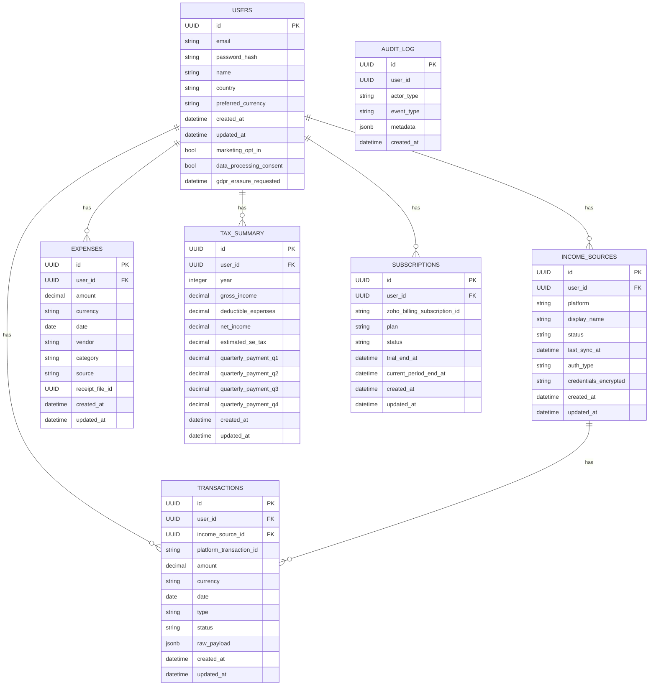

# Data Model

**Version:** 1.1

This document defines the data model for the Gig/Freelance Income Reset application, designed to support a scalable, multi-tenant architecture that aligns with our product-led growth strategy and pricing tiers.

## 1. ERD (Entity-Relationship Diagram)

## 2. Table Schemas & Business Logic

### `subscriptions`

This table is the cornerstone of our revenue model. It links a user to their subscription plan in Zoho Billing, which is the ultimate source of truth for billing.

| Column | Type | Constraints | Description |
| --- | --- | --- | --- |
| `id` | `uuid` | Primary Key | Internal unique identifier. |
| `user_id` | `uuid` | Foreign Key (users.id) | Links the subscription to a user. |
| `zoho_billing_subscription_id` | `text` | Not Null, Unique | The primary key from Zoho Billing. **This is critical for reconciliation.** |
| `plan` | `text` | Not Null | The current plan (`TRIAL`, `STARTER`, `PRO`, `PREMIUM`). This determines feature access. |
| `status` | `text` | Not Null | The subscription status (`ACTIVE`, `CANCELED`, `PAST_DUE`, `TRIALING`). This is synced from Zoho. |
| `trial_end_at` | `timestamp` | | The timestamp when the 15-day free trial expires. |
| `current_period_end_at` | `timestamp` | | The end of the current billing cycle. |

### `income_sources`

This table enables the core value proposition of income aggregation.

| Column | Type | Constraints | Description |
| --- | --- | --- | --- |
| `id` | `uuid` | Primary Key | Unique identifier for the income source. |
| `user_id` | `uuid` | Foreign Key (users.id) | The user who owns this income source. |
| `platform` | `text` | | The platform the income is from (e.g., 'FIVERR', 'UPWORK'). |
| `display_name` | `text` | | A user-friendly name for the income source. |
| `status` | `text` | | The status of the connection ('CONNECTED', 'ERROR', 'DISCONNECTED'). |

## 3. Multi-Tenancy & Security

- **Row-Level Security (RLS):** RLS is not just a security feature; it is a core architectural principle that ensures data isolation between tenants (users). Every query on sensitive tables **must** be filtered by `auth.uid() = user_id`.
- **Data Minimization:** The `raw_payload` in the `transactions` table should only store the absolute minimum data required for reconciliation and debugging. All other raw data from platform APIs should be discarded to minimize our data footprint and compliance risk.

## 4. External ID Mapping & Data Consistency

Our database acts as a central hub, mapping our internal user IDs to the corresponding IDs in the Zoho ecosystem. This is crucial for maintaining data integrity across the entire customer lifecycle.

| External System | Our Table | Our Column | Purpose |
| --- | --- | --- | --- |
| Zoho CRM | `users` | `zoho_crm_contact_id` | Links our user to the CRM contact for sales and marketing. |
| Zoho Billing | `subscriptions` | `zoho_billing_subscription_id` | The authoritative link for a user's subscription status and billing cycle. |
| Zoho Books | `users` | `zoho_books_customer_id` | Links our user to their accounting record in Zoho Books. |
| Zoho Desk | `audit_log` | `zoho_desk_ticket_id` (in metadata) | Tracks support escalations for a complete customer view. |
| Authorize.net | `users` | `authorize_net_customer_profile_id` | Stores the customer profile token from Authorize.net (only if direct integration is used). |
