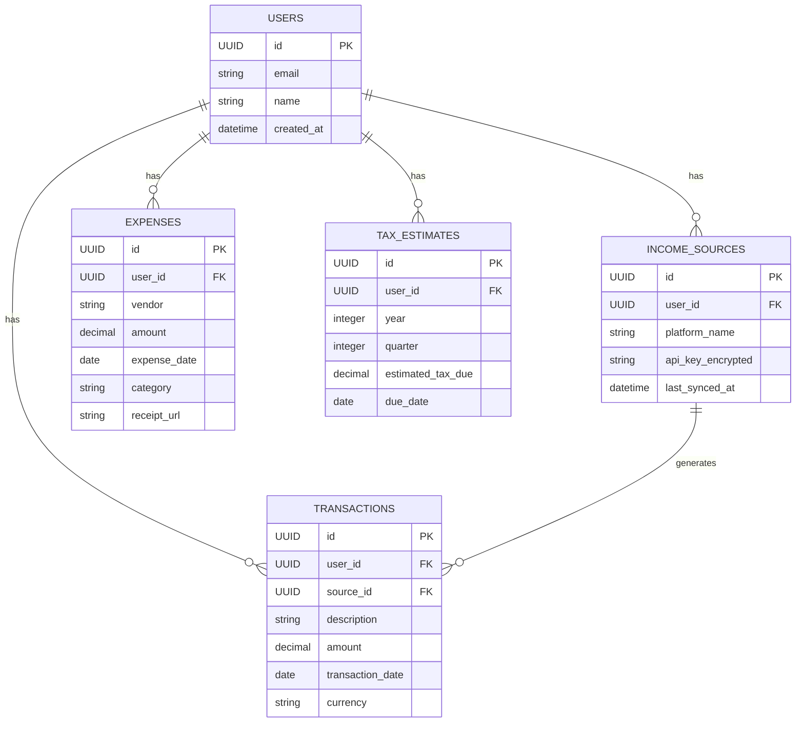

# Data Model

**Version: 4.0**

This document defines the data model for the Freelancer Financial Hub. The model is optimized for aggregating financial transactions and providing the insights needed to solve the core freelancer pain points.

## 1. ERD (Entity-Relationship Diagram)



## 2. Table Schemas & Business Logic

### `income_sources`

Stores the connection details for each platform a user links to their account.

| Column | Type | Constraints | Description |
| --- | --- | --- | --- |
| `id` | `uuid` | Primary Key | Unique identifier for the connected source. |
| `user_id` | `uuid` | Foreign Key (users.id) | The user who owns this connection. |
| `platform_name` | `text` | Not Null | The name of the gig platform (e.g., "Upwork", "Fiverr"). |
| `api_key_encrypted` | `text` | Not Null | The user's API key for the platform, encrypted at rest. |
| `last_synced_at` | `timestamp` | | Timestamp of the last successful sync, used by the cron job. |

### `transactions`

This is the core table of the application, storing every individual income transaction from all sources.

| Column | Type | Constraints | Description |
| --- | --- | --- | --- |
| `id` | `uuid` | Primary Key | Unique identifier for the income transaction. |
| `user_id` | `uuid` | Foreign Key (users.id) | The user this transaction belongs to. |
| `source_id` | `uuid` | Foreign Key (income_sources.id) | The income source this transaction came from. |
| `amount` | `decimal` | Not Null | The amount of income earned. |
| `transaction_date` | `date` | Not Null | The date the income was earned/paid. |

### `expenses`

Stores all user-entered business expenses, which are used to reduce taxable income.

| Column | Type | Constraints | Description |
| --- | --- | --- | --- |
| `id` | `uuid` | Primary Key | Unique identifier for the expense. |
| `user_id` | `uuid` | Foreign Key (users.id) | The user this expense belongs to. |
| `amount` | `decimal` | Not Null | The amount of the expense. |
| `category` | `text` | Not Null | The tax-deductible category (e.g., "Software", "Business Meals"). |
| `receipt_url` | `text` | | A URL to the scanned receipt image in Supabase Storage. |

### `tax_estimates`

Stores the calculated quarterly tax estimates for each user.

| Column | Type | Constraints | Description |
| --- | --- | --- | --- |
| `id` | `uuid` | Primary Key | Unique identifier for the tax estimate record. |
| `user_id` | `uuid` | Foreign Key (users.id) | The user this estimate belongs to. |
| `year` | `integer` | Not Null | The tax year. |
| `quarter` | `integer` | Not Null | The quarter of the tax year (1, 2, 3, or 4). |
| `estimated_tax_due` | `decimal` | Not Null | The calculated amount of self-employment tax due. |
| `due_date` | `date` | Not Null | The official IRS deadline for the quarterly payment. |

## 3. Row-Level Security (RLS)

RLS is straightforward and absolutely critical for data privacy. The policy for every table is the same: a user can only access their own data.

```sql
-- Example RLS policy for the transactions table
CREATE POLICY "Users can only see their own transactions" ON "transactions"
FOR ALL USING (
    auth.uid() = user_id
);

-- This exact same policy structure will be applied to:
-- income_sources, expenses, and tax_estimates.
```

This simple but powerful policy ensures that there is no possibility of data leakage between users, providing the bank-level security required for handling sensitive financial information.
