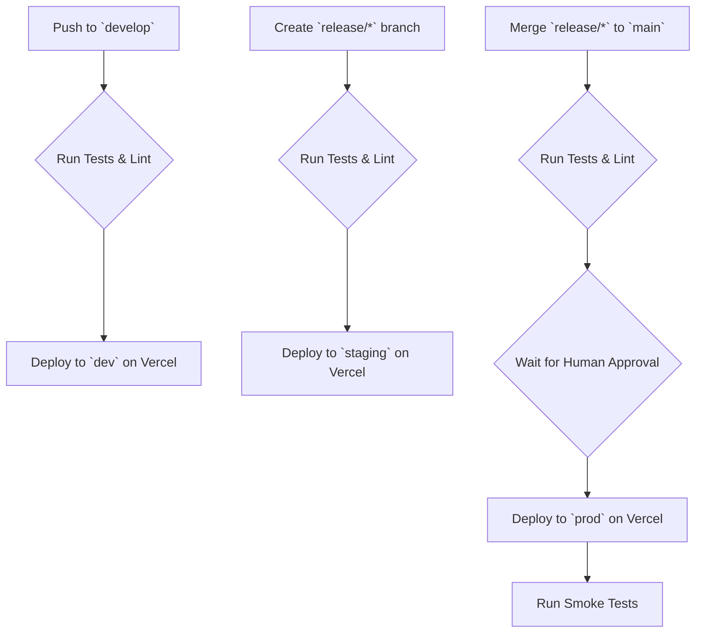

# Deployment Runbook

**Version:** 1.1

This document provides the standard operating procedures for deploying the Gig/Freelance Income Reset application. The process is designed to be automated, reliable, and aligned with our business goals of rapid iteration and high availability.

## 1. Environments & Promotion Strategy

The application uses a standard GitFlow-based promotion strategy across three distinct environments. This ensures stability in production while allowing for rapid development.

| Environment | Branch | Purpose | Key Characteristics |
| :--- | :--- | :--- | :--- |
| **`dev`** | `develop` | Development & Integration | Deployed automatically on every push to `develop`. Used for internal testing and validation. |
| **`staging`** | `release/*` | Pre-Production QA | A mirror of production. Deployed when a `release` branch is created. Used for final QA, E2E testing, and stakeholder demos. |
| **`prod`** | `main` | Live Production | Deployed only after a `release` branch is merged into `main`. **Requires manual approval.** |

Each environment has its own dedicated Supabase project, Vercel project, and a corresponding set of secrets for Zoho and other third-party services.

## 2. CI/CD Pipeline (GitHub Actions)

The CI/CD pipeline is fully automated via GitHub Actions to support our 12-week MVP timeline and subsequent rapid iteration.

**Human Approval Gate:** The deployment to production is the only step that requires manual intervention. This is a critical control to prevent accidental or untested code from reaching users. The approval must be given by the designated Lead Engineer in the GitHub Actions UI.

## 3. Zero-to-Production Setup

This checklist outlines the process for bootstrapping a new environment from scratch.

1.  **Create Supabase Project:**
    - Provision a new project in the Supabase dashboard.
    - Run the latest database schema migrations from the `main` branch.
    - Configure RLS policies.
2.  **Create Vercel Project:**
    - Create a new project linked to the GitHub repository.
    - Set the framework to "Vite" and configure the root directory.
3.  **Configure Secrets:**
    - Create a new set of API keys for Zoho (CRM, Billing, etc.) for the new environment.
    - Populate all required environment variables in both the Supabase and Vercel project settings. **Never commit secrets to the repository.**
4.  **Initial Deployment:**
    - Trigger a deployment in Vercel from the appropriate branch (`main` for prod, `develop` for dev).
5.  **DNS & Domain:**
    - For the `prod` environment, configure the custom domain and DNS records in Vercel.

## 4. Rollback & Incident Response

- **Frontend Rollback:** Vercel provides instant rollbacks. If a production deployment introduces a critical bug, the previous deployment can be instantly promoted to production via the Vercel dashboard. This is the primary rollback mechanism and should take < 1 minute.
- **Backend Rollback:** Database changes are harder to roll back. All database migrations must be written to be backward-compatible. In a critical failure scenario, the database would be restored from the last known good backup (point-in-time recovery provided by Supabase).

## 5. Feature Flags (LaunchDarkly / Vercel)

New, high-risk features will be deployed to production behind feature flags. This allows us to:
- Decouple deployment from release.
- Perform canary releases to a small subset of users (e.g., internal team, beta testers).
- Instantly disable a feature if it causes problems, without requiring a full rollback.

This strategy is key to our goal of continuous delivery while maintaining a stable and reliable service for our users.
